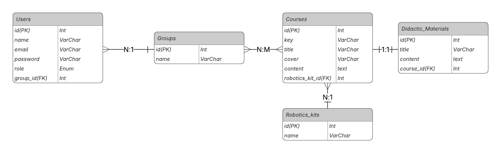

# Activity 7 - Robotics School Platform

## Descripción
Plataforma para una pequeña escuela de robótica que permite gestionar 
usuarios, grupos, cursos y material didáctico. Los maestros pueden 
asignar cursos a grupos y los estudiantes pueden consultar el contenido 
directamente en la plataforma.

## Tecnologías
- Laravel 12
- MySQL
- PHP

## ER Diagram
